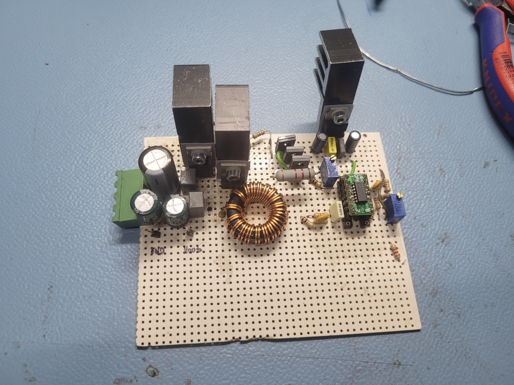
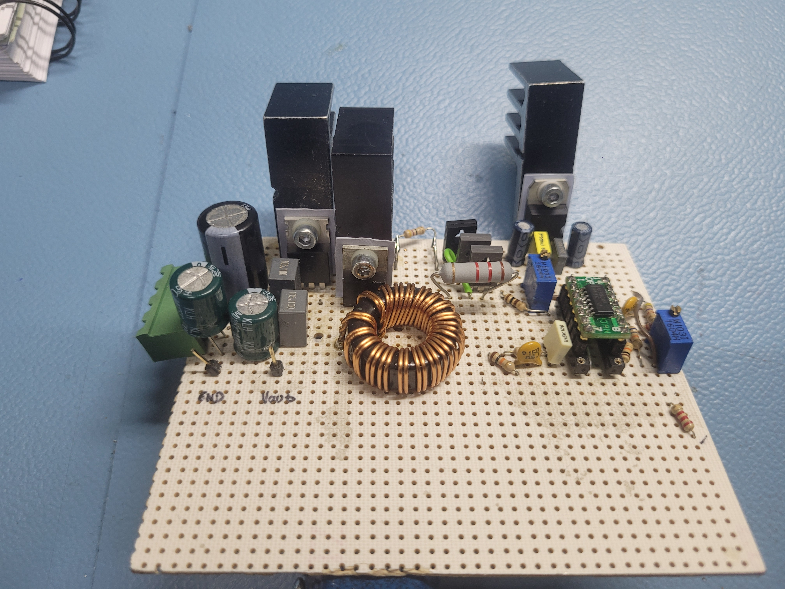
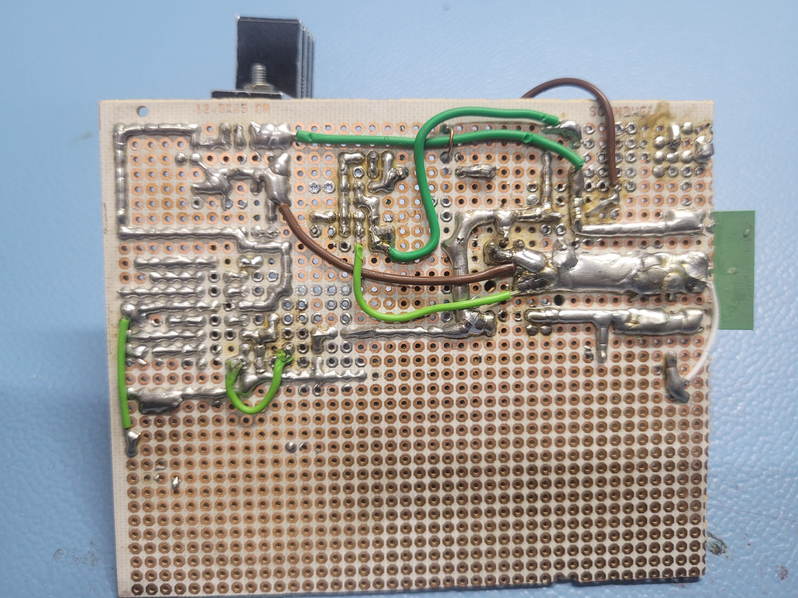
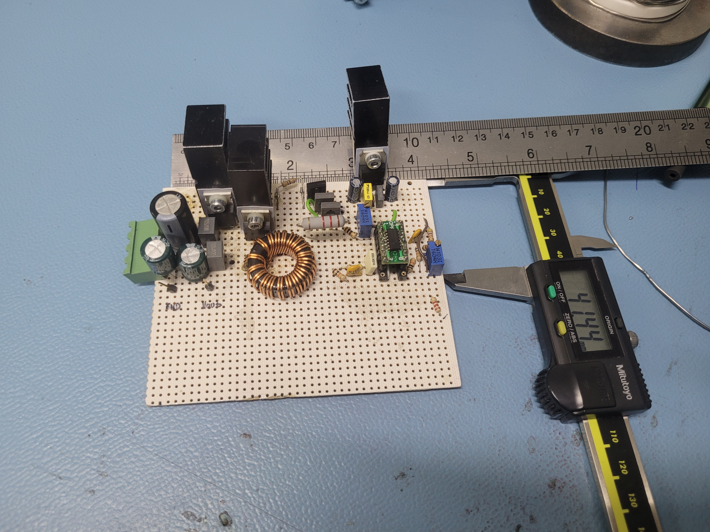
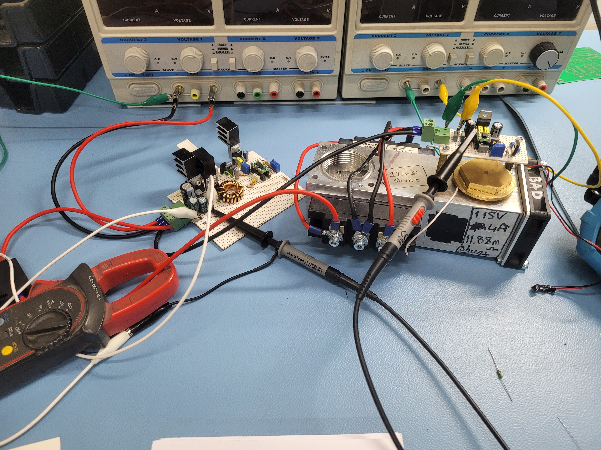
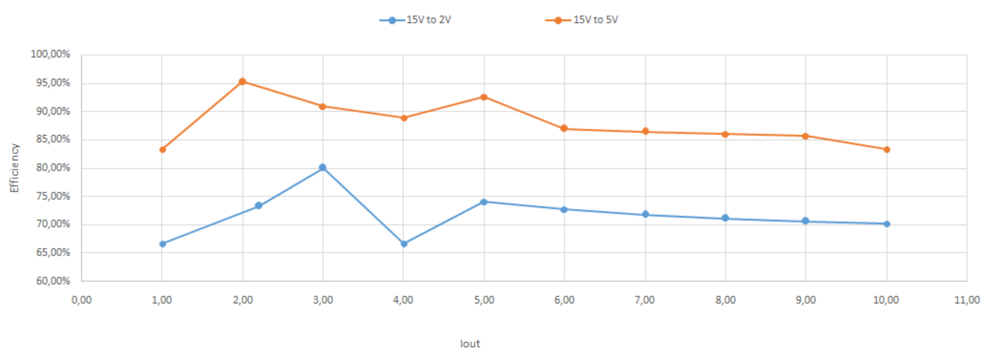
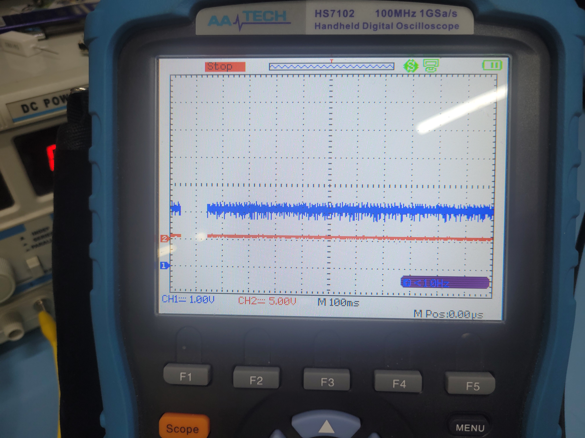
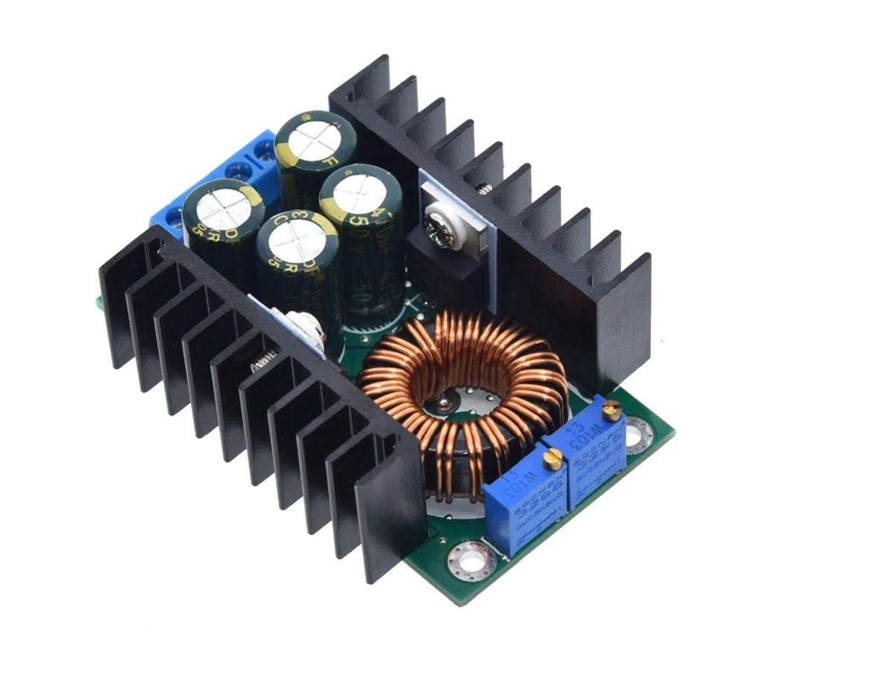

# Asynchronous Buck Converter
 Asynchronous Buck Converter (Type II Compensator)
 
Note - OPA4197 is used, I put LT1014 on schematic because opa shown as one IC on easyEDA lib to schematic. Opamp shape make schematic more readable.
Compensator values in the schematic are wrong!!! 

Also check out low voltage shut down network and synchronous driver which adaptive dead time(ish). I tried synchronous but, didn't have much efficiency profits.
Bad efficiency mostly caused by discrete driver circuit and switching losses.

Perf Board

Regulation of my buck while sunk 6A from it

Regulation of XL4016 module while sunk 6A from it

